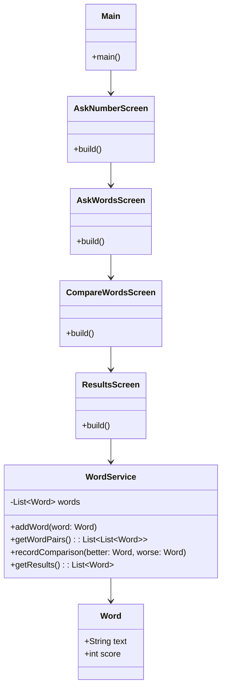
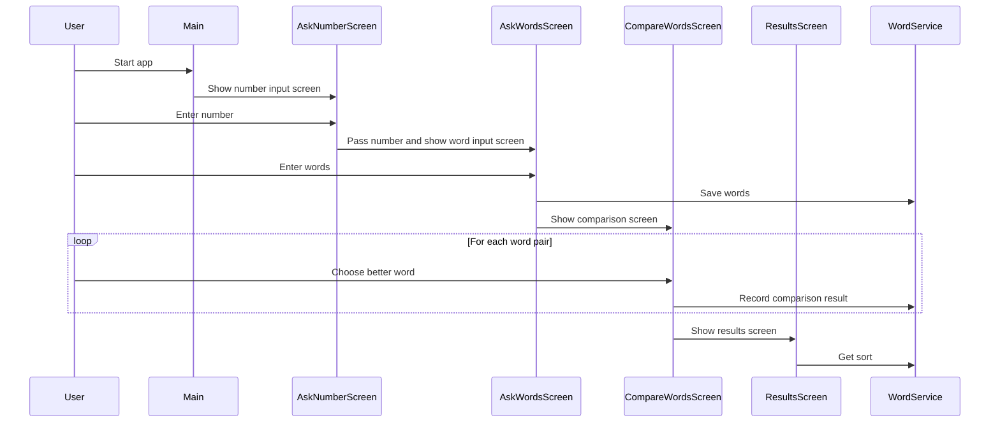

# Arvokello

This application is called Arvokello. It allows its user to rank words (=values) into order by comparing two values at a time.

This Flutter app allows a user to:
1. Enter a number (n).
2. Input n amount of words.
3. Compare the words in pairs, selecting the better one each time.
4. See the final ranking of all words based on their selections.

## Structure
- **Main.dart**: App entry point and routing.
- **Screens**: UI for each step of the process (`AskNumberScreen`, `AskWordsScreen`, `CompareWordsScreen`, `ResultsScreen`).
- **Models**: Data structures (e.g., `Word`).
- **Services**: Business logic (`WordService`) for storing words, recording comparisons, and generating rankings.

The code is organized so that UI, logic, and data are separated, making the project easy to maintain and extend.

